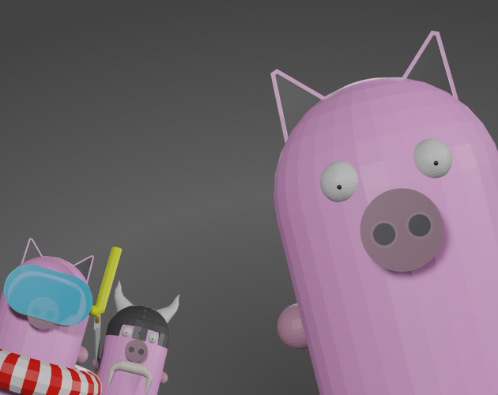
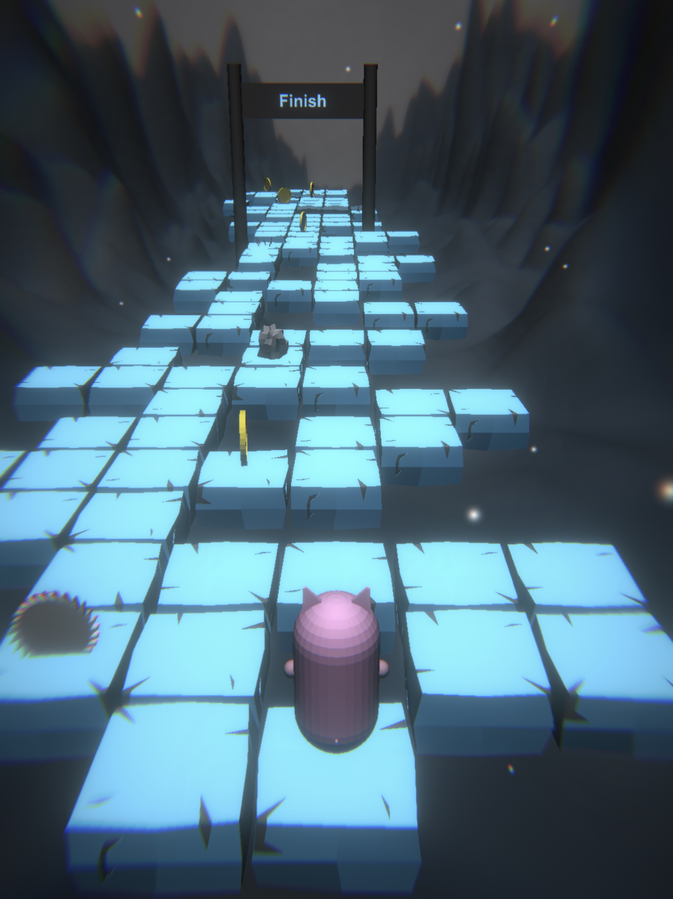
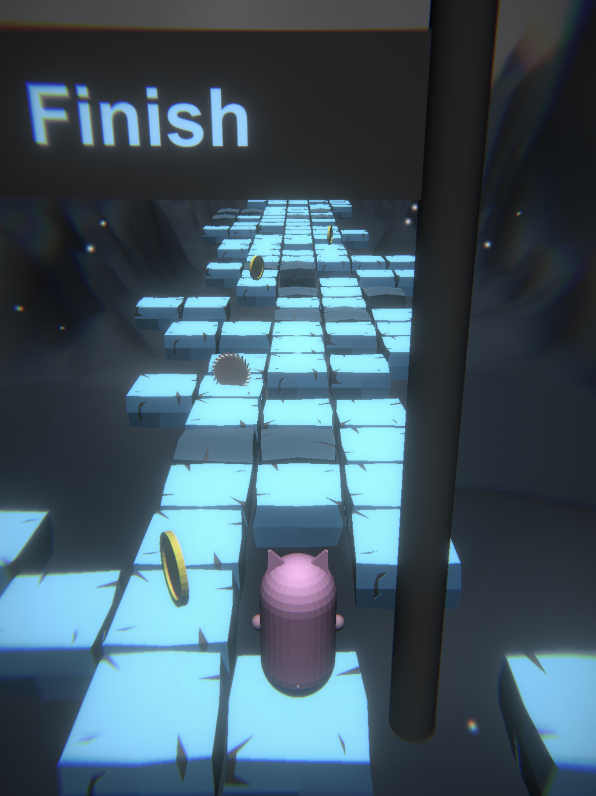
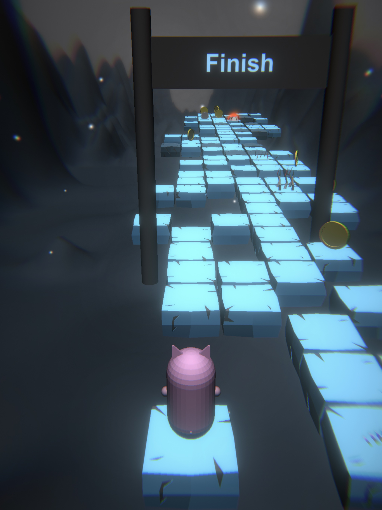
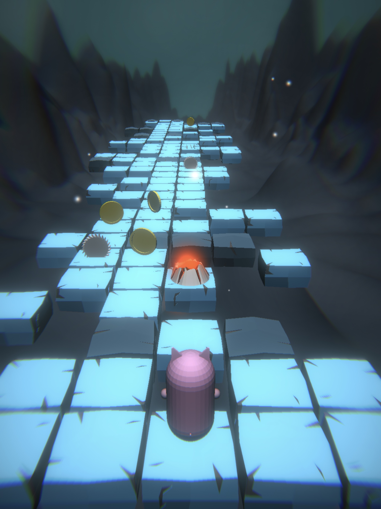
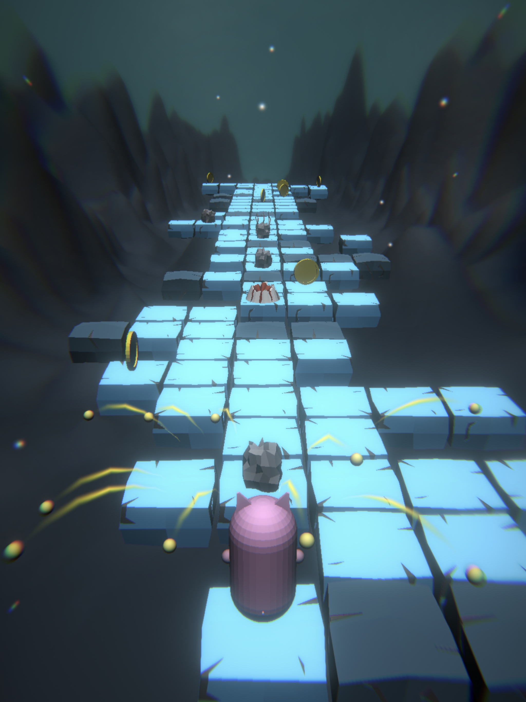
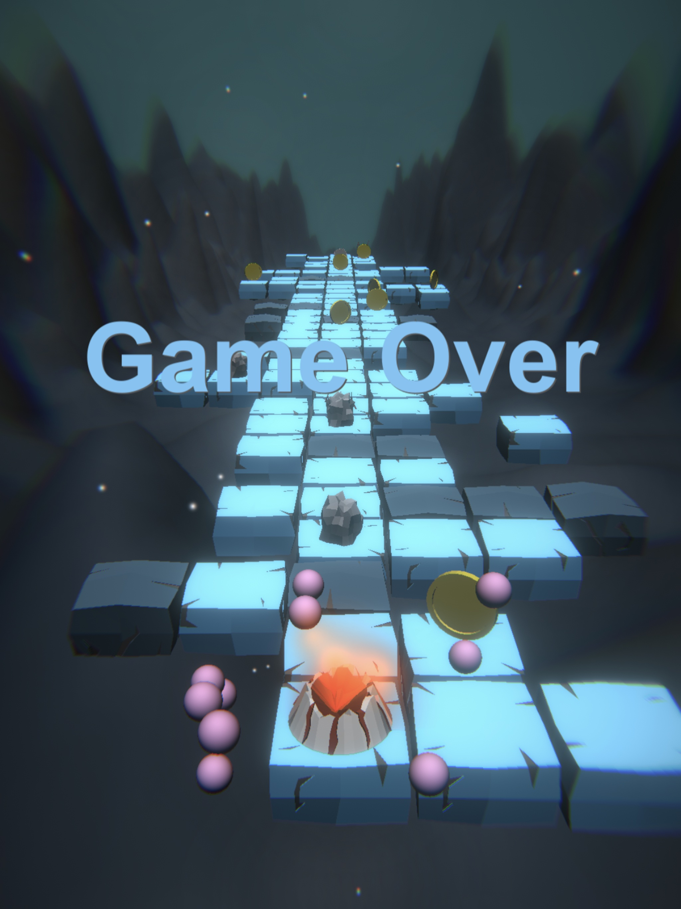

# Jumpig Adventure

[https://pixelook.itch.io/jumpig-adventure](https://pixelook.itch.io/jumpig-adventure)

Casual game for [iOS](https://itunes.apple.com/us/app/jumpig-adventure/id1547258985?mt=8&uo=4) and [Android](https://play.google.com/store/apps/details?id=io.pixelook.jumpig) mobile phones.

## Videos

[Youtube: Jumpig - Gameplay #1](https://youtu.be/NX6X8RI5mc8)  
[Youtube: Jumpig - Making of game | unity3d devlog #3](https://youtu.be/xhGkrxtE-Js)  
[Youtube: Jumpig - Making of game | unity3d devlog #2](https://youtu.be/LmbaL5LS49c)  
[Youtube: Jumpig - Making of game | unity3d devlog #1](https://youtu.be/TEwOPJlyzF4)

## Used tools
[Affinity Designer](https://affinity.serif.com/en-gb/designer/) - for drawing  
[Bfxr](http://bfxr.net/), [ocenaudio](https://www.ocenaudio.com) - for SFX and sounds  
[ecrettmusic](http://ecrettmusic.com/) - for the music  
[Unity3d](https://unity.com) - hmm...

## Pictures

### Cover

### From game

